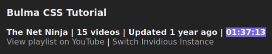
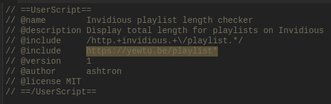

A userscript for displaying the total runtime of all videos in playlists on [Invidious](https://github.com/iv-org/invidious) instances.

By default, this script will run on any URL containing the word "invidious." To enable this script for an Invidious instance that does not follow this format, @include it in the userscript.

[Greasy Fork](https://greasyfork.org/en/scripts/447887-invidious-playlist-length-checker)

length + checker = [lekker](https://www.urbandictionary.com/define.php?term=lekker)